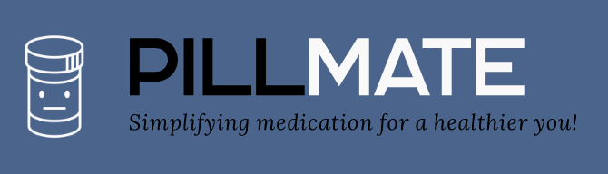

# PillMate

## Overview

PillMate is a mobile application designed to improve medication adherence and enhace personal health management. Built with [React Native](https://reactnative.dev/) and [Expo](https://expo.dev/), it provides intelligent medication reminders, seamless communication with healthcare professionals, and a comprehensive health experience.

## Features

- **Intelligent Medication Reminders**: Utilizes artificial intelligence to personalize medication notifications based on user needs.

- **Healthcare Professional Communication**: Facilitates easy communication between users and their healthcare providers, ensuring coordinated and effective healthcare.

- **Comprehensive Personal Health Experience**: Goes beyond simple medication reminders, allowing users to store medical information, access updated health news, and maintain health records.

- **Data Security**: Committed to protecting user information with the highest standards of security and compliance.

## Getting Started

### Prerequisites

- Node.js and npm installed

- Expo CLI installed globally (`npm install -g expo-cli`)

### Installation

1. Clone the repository `git clone https://github.com/miguelcsx/pillmate.git`
2. Navigate to the project directory `cd pillmate`
3. Install dependencies `npm install`
4. Start the Expo development server: `npm start`

## Usage

- Scan the QR code generated by Expo to launch the app on you Expo client.
- Explore the features and functionalities to understand how PillMate enhances medication management and personal health.

## Contributing

We welcome contributions! If you find any issues or have suggestions for improvements, fell free to open an issue or submit a pull request.

## License

This project is licensed under the [MIT License](./LICENSE)
